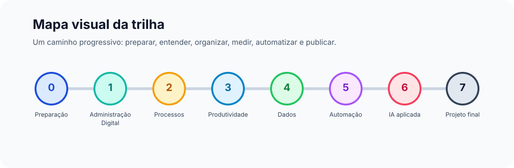

  

<h1 align="center">Administração Tech</h1>

  Uma trilha autodidata aberta para aprender Administração Digital, Automação e Inteligência Artificial por meio de projetos práticos.

  <a href="docs/modulos/modulo-00-preparacao.md"><strong>Começar pelo Módulo 0</strong></a>
  ·
  <a href="docs/02-trilha-de-aprendizado.md">Ver trilha completa</a>
  ·
  <a href="CONTRIBUTING.md">Contribuir</a>

> Status: versão inicial colaborativa. O material está em construção e recebe sugestões por Issues e Pull Requests.

## Visão rápida

O objetivo do projeto é reunir, em Markdown, um caminho de estudo acessível para pessoas que querem entender administração com uma visão atual: processos, dados, tecnologia, automação, IA, produtividade e criação de soluções reais.

<table>
  <tr>
    <td width="33%" align="center">
       
      <strong>Administração Digital</strong> 
      Fundamentos de gestão, processos, organização, estratégia, projetos e tomada de decisão.
    </td>
    <td width="33%" align="center">
       
      <strong>Automação</strong> 
      Ferramentas digitais para reduzir tarefas repetitivas e criar fluxos mais eficientes.
    </td>
    <td width="33%" align="center">
       
      <strong>Inteligência Artificial</strong> 
      IA aplicada a pesquisa, análise, planejamento, escrita, atendimento e decisões.
    </td>
  </tr>
</table>

## Para quem é

Esta trilha foi pensada para iniciantes adultos que querem estudar de forma independente, mesmo sem experiência prévia em tecnologia.

Ela também pode ser útil para:

- estudantes de Administração, Gestão, Contabilidade, Economia e áreas próximas;
- profissionais que querem automatizar rotinas administrativas;
- pessoas interessadas em IA aplicada a negócios, projetos e produtividade;
- educadores que desejam adaptar uma trilha aberta para aulas, oficinas ou grupos de estudo.

## Como estudar

<table>
  <tr>
    <td width="50%">
      <strong>1. Leia com calma</strong> 
      Comece pela <a href="docs/00-visao-geral.md">visão geral</a> e entenda a proposta.
    </td>
    <td width="50%">
      <strong>2. Crie uma rotina</strong> 
      Use o guia <a href="docs/01-como-estudar.md">como estudar</a> para montar seu ritmo.
    </td>
  </tr>
  <tr>
    <td width="50%">
      <strong>3. Faça entregáveis</strong> 
      Aplique cada tema em mapas, planilhas, prompts, automações e projetos.
    </td>
    <td width="50%">
      <strong>4. Compartilhe melhorias</strong> 
      Abra Issues, envie Pull Requests e ajude a tornar a trilha mais clara.
    </td>
  </tr>
</table>

## Mapa visual da trilha

  

| Etapa | Tema | Entregável sugerido |
| --- | --- | --- |
| 0 | [Preparação e método autodidata](docs/modulos/modulo-00-preparacao.md) | plano semanal de estudos |
| 1 | Fundamentos de Administração Digital | mapa de uma organização ou rotina |
| 2 | Processos e melhoria contínua | mapa de processo com gargalos |
| 3 | Produtividade e ferramentas digitais | sistema pessoal de organização |
| 4 | Dados para decisão | planilha ou painel simples |
| 5 | Automação administrativa | fluxo automatizado documentado |
| 6 | IA aplicada à administração | biblioteca de prompts e casos de uso |
| 7 | Projetos e portfólio | projeto final publicado |

## Aprender fazendo

<table>
  <tr>
    <td width="33%" align="center">
       
      <strong>Dados simples</strong> 
      Planilhas, indicadores e painéis para apoiar decisões.
    </td>
    <td width="33%" align="center">
       
      <strong>Projetos práticos</strong> 
      Atividades aplicadas para construir um portfólio.
    </td>
    <td width="33%" align="center">
       
      <strong>Comunidade aberta</strong> 
      Conteúdo pensado para colaboração no GitHub.
    </td>
  </tr>
</table>

O foco não é apenas consumir conteúdo. A ideia é estudar criando entregáveis: diagnósticos, mapas de processo, dashboards simples, prompts, automações, documentos, planos de ação e pequenos projetos de portfólio.

## Estrutura do repositório

- [docs/00-visao-geral.md](docs/00-visao-geral.md): propósito, princípios e resultado esperado.
- [docs/01-como-estudar.md](docs/01-como-estudar.md): rotina, ciclos de estudo e avaliação.
- [docs/02-trilha-de-aprendizado.md](docs/02-trilha-de-aprendizado.md): módulos da trilha.
- [docs/03-projetos-praticos.md](docs/03-projetos-praticos.md): desafios para aplicar o aprendizado.
- [docs/04-ferramentas.md](docs/04-ferramentas.md): ferramentas sugeridas por categoria.
- [docs/05-referencias.md](docs/05-referencias.md): livros, cursos, documentações e fontes abertas.
- [docs/modulos/modulo-00-preparacao.md](docs/modulos/modulo-00-preparacao.md): primeira aula para iniciar os estudos.
- [docs/checklist-editorial.md](docs/checklist-editorial.md): critérios para revisar contribuições.
- [CONTRIBUTING.md](CONTRIBUTING.md): como colaborar.

## Como contribuir

Você pode colaborar de várias formas:

- abrir uma Issue sugerindo correção, módulo, ferramenta ou projeto prático;
- enviar um Pull Request com melhorias no texto;
- propor referências confiáveis;
- adaptar atividades para diferentes perfis de estudante;
- revisar clareza, acessibilidade e organização do material.

Antes de contribuir, leia o [guia de contribuição](CONTRIBUTING.md). Para revisar um texto antes de enviar, use o [checklist editorial](docs/checklist-editorial.md).

## Licença

O conteúdo educacional deste projeto está disponível sob a licença [Creative Commons Attribution 4.0 International](LICENSE).

Você pode compartilhar e adaptar o material, inclusive para fins educacionais e profissionais, desde que atribua o crédito ao projeto e aos autores das contribuições.

Caso o repositório passe a incluir código, scripts ou ferramentas próprias no futuro, esses arquivos poderão usar uma licença de software separada, como MIT, indicada no próprio arquivo ou em uma licença específica.
